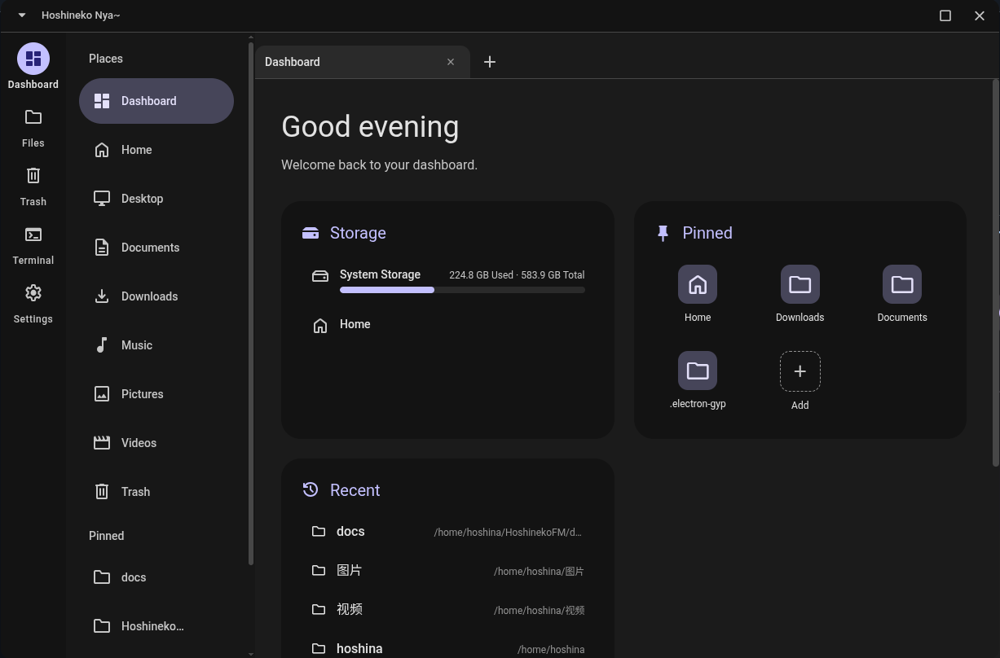

[English](README.md)
<p align="center">
  
</p>

# Hoshineko 文件管理器

<p align="center">
  
</p>

Hoshineko 文件管理器是一款基于 Material 3 设计语言、Electron 和 React 框架构建的现代“性能至上”文件管理器。
该项目基于 [bhimio1](https://github.com/bhimio1) 的 [material-3-file-explorer](https://github.com/bhimio1/material-3-file-explorer) 项目进行修改与重构。由于原项目已停止更新维护，且我们致力于开发一款符合 Material 3 设计标准的文件管理器，因此发起了此重构项目。

## 特性

- **Material Design 3 界面**：具有动态主题的现代界面。
- **"性能优先"**：基于虚拟列表（react-window）的文件列表，支持网格/列表双视图、语义分组与多维排序。
- **标签页**：多标签页导航，支持虚拟路径（`app://dashboard`、`trash://`），每个标签独立状态。
- **多功能栏**：整合统一的搜索栏与地址栏（`find -iname` 搜索，限 100 条结果），支持高级过滤（类型、最小/最大大小）；搜索结果可右键「定位到所在文件夹」（跳转父目录并选中该条目）。
- **内建终端**：内嵌终端（xterm.js + node-pty，会话按窗口隔离），支持目录与可执行文件「在系统默认终端中打开」（7 级终端检测链），亦可经 `~/.config/HoshinekoFM/terminal.conf` 指定自定义终端（优先于整个检测链）。
- **回收站**：按 freedesktop 规范实现 `trash://` 视图——还原、永久删除、清空，外部改动自动刷新。
- **多窗口**：所有窗口共享同一后端；单实例锁二次启动开新窗口；跨窗口剪贴板（重启后可粘贴）与跨窗口语言同步。
- **设备管理**：完整 `lsblk` 设备树，`udisksctl` 挂载/卸载/弹出，UDisks2 热插拔监听（轮询兜底），支持 MTP 手机 / PTP 相机（GVfs，点击自动挂载、USB 地址漂移处理）。
- **拖放系统**：原生 OS 拖拽（LocalSend 等外部应用可收到真实文件）；同窗口可拖到文件夹、面包屑胶囊、地址栏（当前目录）、标签页、侧边栏位置与设备；M3 移动/复制/取消对话框 + 冲突处理（跳过/自动重命名/手动重命名/取消）；Wayland 合成 drop 兜底与边缘自动滚动。
- **批量任务**：复制/移动/回收站/永久删除走任务管线（进度 toast、可取消、部分失败提示）；跨设备移动（EXDEV）自动回退复制+删除。
- **批量重命名**：查找替换 / 前缀 / 后缀 / 序号四种模式，实时预览 + 逐条冲突检测。
- **压缩归档**：右键创建 zip / tar.gz（`zip -r` / `tar -czf`），已存在的归档绝不覆盖。
- **属性与权限**：查看位置、大小、修改时间、权限位（`drwxr-xr-x`）与属主，并可就地修改权限（3 位八进制 chmod）。
- **固定项**：仪表盘可固定文件与文件夹（支持拖拽排序），侧边栏可固定目录——支持文件管理器选择、目录右键菜单、拖动文件夹到固定按钮三种方式。
- **内置文件选择器**：独立选择器窗口贯穿全应用——可选条目类型声明（文件/文件夹/全部）、文件类型过滤（底部下拉：「所有文件」+ 声明类型，标签由 MIME 描述体系生成）、初始目录、并发实例相互独立；亦可作为 **xdg-desktop-portal FileChooser 后端**——外部程序（GTK/Qt）经标准 portal 接口打开本选择器（OpenFile 含过滤器；SaveFile v1 不支持；需安装 portal 配置启用，见 docs/portal-filechooser.md）。
- **仪表盘**：问候语、统一存储区（系统 `/`、主页、热插拔外接设备，列表项可点击跳转）、固定项、最近访问。
- **主题系统**：12 个 Material 3 预设色盘、自定义调色盘（HCT）、壁纸取色（matugen + nativeImage 兜底）、导入 matugen 主题、系统主题（DMS）继承与黑暗主题开关（跟随系统/强制暗色/强制亮色，全窗口即时生效）。
- **文件预览**：可选且常驻的侧面板（设置 → 行为，默认关闭）——在文件区右侧「挤压」出现；未选中条目时显示当前目录的只读属性，单选目录时显示该目录的只读属性（与右键属性对话框共用属性网格，权限只读）；单选文件时支持图片、音频、视频（mp4/webm/ogg/mkv，可拖动进度条）、PDF（pdf.js，前 5 页 + 超出时「全文共 N 页」说明）、归档内容列表（zip/tar/7z）、Markdown 渲染与文本/代码（512 KiB 上限）；分隔条拖动调整比例（20%–60%，持久化）；多选显示「无法预览」占位；与文件区一起随内置终端挤压。
- **界面缩放**：整页缩放 50%–200%，全窗口（含文件选择器）实时同步。
- **自定义 M3 标题栏**（可选，默认跟随系统）：frameless 窗口 + 最小化/最大化还原/关闭三按钮 + 「v」窗口菜单 + 实时窗口标题（仪表盘 →「Hoshineko Nya~」、回收站或目录名/完整路径）同步至任务栏——平铺 WM（niri/hyprland/i3/sway）自动隐藏、常规 DE 显示、可手动覆盖；保留 F12 开发人员工具。
- **智能右键菜单**：按条目类型（文件/目录/设备/回收站/背景）动态生成菜单项，适配触屏长按操作。
- **选择与快捷键**：Ctrl/Shift 多选、Ctrl+A、橡皮筋框选（4 种模式 + 边缘自动滚动）、Delete/Shift+Delete/Ctrl+C/X/V、F5。
- **国际化**：12 种语言，确定时应用并跨窗口同步。

## 从原项目的重构和更改

- **自由多选**：具备多选功能，并针对 LocalSend 等应用进行了拖拽传输优化。
- **更好的文件分类**：调整了文件分类机制，扩大了可分类的文件类型范围；在 `/dev` 目录下支持显示对应的设备类型图标。
- **便捷而智慧的右键菜单**：调整了右键菜单架构，支持根据选定项目的不同类型动态显示相应菜单项，并扩展了菜单功能；该菜单设计同时适配触屏设备的长按操作。
- **针对 [material-3-file-explorer](https://github.com/bhimio1/material-3-file-explorer) 项目进行了多项架构重构与功能扩充，以满足现代文件管理器的标准与特性。**

## 国际化 / Internationalization

### 现在支持 / Currently Supported

| 代码 (Code) | 本地语言名称 (Native Name) | 中文描述 (Chinese Description) | 英语描述 (English Description) |
| :--- | :--- | :--- | :--- |
| **zh-CN** | 中文 | 简体中文 | Simplified Chinese |
| **zh-HK** | 繁體中文 (香港) | 繁体中文（香港） | Traditional Chinese (Hong Kong) |
| **zh-CT** | 粵語 | 粤语 | Cantonese |
| **zh-TW** | 繁體中文 (台灣) | 正体中文（台湾） | Traditional Chinese (Taiwan) |
| **zh-AC** | 交流电中文 | 交流电中文 | AC Chinese |
| **en-US** | English | 英语 | English |
| **ja-JP** | 日本語 | 日语 | Japanese |
| **ko-KR** | 한국어 (대한민국) | 韩语（大韩民国） | Korean (Republic of Korea) |
| **ko-KP** | 한국어 (조선민주주의인민공화국) | 韩语（朝鲜民主主义人民共和国） | Korean (Democratic People's Republic of Korea) |
| **ko-CN** | 조선어 (중국) | 朝鲜语（中国） | Korean (China) |
| **ru-UA** | Русский (Украина) | 俄语（乌克兰） | Russian (Ukraine) |
| **uk-UA** | Українська | 乌克兰语（乌克兰） | Ukrainian (Ukraine) |

### 计划支持 / Planned Support

暂无。

## 尚未实现

- 收藏夹/书签（由仪表盘/侧边栏固定功能替代）。
- 格式化无文件系统设备（有意留给专业磁盘工具）。
- 自动更新。
- 跨平台支持（仅 Linux；依赖 inotify、udisks2、dbus-next、gvfs 与 GNU coreutils）。

## 主题

主题颜色系统位于 设置 → 外观 → 主题颜色：以单个种子色生成整套 Material 3 明暗角色——预设与自定义色使用 HCT 引擎（`@material/material-color-utilities`），壁纸取色使用 matugen CLI（未安装 matugen 时以 `nativeImage` 直方图兜底）。

### 颜色来源

1. **12 个 Material 3 预设色盘**——内置种子色调色盘。
2. **自定义调色盘**——色相滑条 + 饱和度/明度方块 + hex 输入（HCT）。
3. **壁纸取色**——从壁纸提取种子色。
4. **导入 matugen 主题**——读取 `~/.config/matugen/theme.css`。
5. **系统主题（DMS）**——继承桌面环境配色（`dms-colors.json`）；未安装 DMS 时禁用。

### 黑暗主题

- **跟随系统**（默认）——检测链：DMS（经外观门户）→ GNOME → KDE，检测不到回退暗色。
- **强制暗色 / 强制亮色**——经 Electron `nativeTheme` 应用，全窗口（含文件选择器）即时同步。

点「应用/确定」后生效，持久化于 `settings.theme`（跨窗口同步）。

### Matugen CLI（可选）

未保存主题颜色配置时，启动将回退读取 Matugen 生成的主题文件。

1. 安装 [Matugen](https://github.com/InioX/matugen)。
2. 在 `~/.config/matugen/theme.css` 生成主题文件。
3. 启动时软件会自动探测并应用该主题。

一个从墙纸中生成主题的样例方式：
```bash
mkdir -p ~/.config/matugen

matugen image --type scheme-tonal-spot /path/to/bg/backgrounda.jpg > ~/.config/matugen/theme.css
```

其中 --type指定调色模式,一共有：

1.scheme-tonal-spot（默认）：经典的 Material 3 调色盘，颜色相对克制、和谐。

2.scheme-vibrant：高饱和度，颜色更具活力。

scheme-expressive：更丰富的混合色彩，对比明显。

scheme-monochrome：单色/黑白灰调。

## 安装

请切换到“发布”页面。

### 手动构建

1. 克隆存储库:
   ```bash
   git clone new git
   cd Hoshineko
   ```

2. 安装依赖:
   ```bash
   npm install
   ```

3. 在开发模式运行:
   ```bash
   npm run dev
   npm run electron:dev
   ```

4. 构建为成品包:
   ```bash
   npm run electron:build
   ```

## 测试

端到端测试位于 `scripts/e2e/`（12 套用例，无测试框架——Electron 自身驱动真实构建，`sendInputEvent` 模拟输入、`executeJavaScript` 断言）：

```bash
npm run e2e                # 先构建，再依次运行 scripts/e2e/*.test.cjs
npx electron scripts/e2e/01-file-list.test.cjs   # 单跑一套
```

需要图形会话；无头 CI 用 `xvfb-run -a npm run e2e`。已知坑点（React 受控输入、双击语义、对话框串行化延迟、会话级共享缩放）记录在 `AGENTS.md` 与 `scripts/e2e/harness.cjs`。

## 协议

MIT
