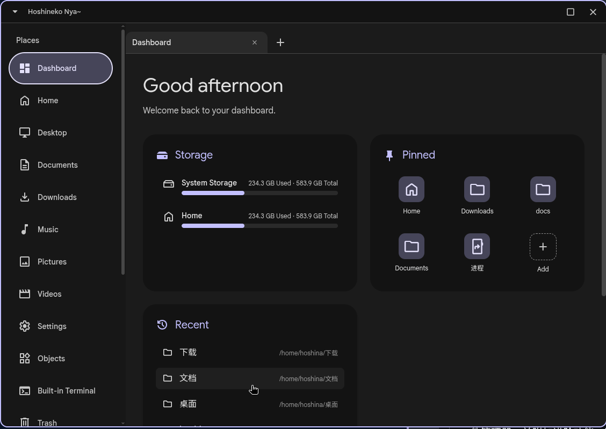

[简体中文](README-zh.md)
<p align="center">
  
</p>

# Hoshineko Explorer

- "An advanced Material 3 designed file manager"

<p align="center">
  
</p>

Hoshineko Explorer is a modern file manager built on the Material 3 design language, Electron, and React frameworks.
This project is a modification and refactoring based on the [material-3-file-explorer](https://github.com/bhimio1/material-3-file-explorer) project by [bhimio1](https://github.com/bhimio1). Since the original project has ceased updates and maintenance, and we are committed to developing a file manager that complies with Material 3 design standards while adding advanced features, this refactoring project was initiated.

## "Performance Concerns First"

- Although we have implemented file lists based on virtual scrolling (react-window), supporting grid/list dual views (one-click toggle in the top right), semantic grouping, and multi-dimensional sorting; as well as optimizations like image caching, you still need to know—frankly speaking—that before using a damn Electron app, you must first worry about performance.

## Features

- **Material Design 3 Interface**: A modern interface with dynamic theming.
- **Tabs**: Multi-tab navigation supporting virtual paths (`app://dashboard`, `trash://`), with independent state for each tab.
- **Address Bar**: Integrated unified search and address bar, supporting advanced filtering (type, min/max size); right-clicking search results allows you to "Open File Location" (jumps to the parent directory and selects the item).
- **Built-in Terminal**: Embedded terminal (xterm.js + node-pty, sessions isolated by window).
- **Open in Terminal**: Supports "Open in System Default Terminal" for directories and executable files (7-level terminal detection chain), or specifying a custom terminal via `~/.config/HoshinekoFM/terminal.conf` (prioritized over the entire detection chain).
- **Trash**: Implements `trash://` view according to freedesktop specifications—restore, permanently delete, empty, auto-refreshing on external changes.
- **Multi-Window**: All windows share the same backend; single-instance lock opens a new window on secondary launch; cross-window clipboard (pasteable after restart) and cross-window language synchronization.
- **Create Launcher Entry**: Settings for this can be found in Settings-Shortcuts, allowing manual creation of a .desktop file on the desktop or adding Hoshineko to the application menu.
- **Device Management**: Full `lsblk` device tree, `udisksctl` mount/unmount/eject, UDisks2 hotplug listening (with polling fallback), supports MTP phones / PTP cameras (GVfs, click to auto-mount, USB address drift handling).
- **Drag and Drop System**: Native OS drag and drop (external apps like LocalSend can receive real files); supports dragging to folders, breadcrumb pills, address bar (current directory), tabs, sidebar locations, and devices within the same window; M3 move/copy/cancel dialogs + conflict resolution (skip/auto-rename/manual rename/cancel); Wayland synthetic drop fallback and edge auto-scrolling.
- **Batch Tasks**: Copy/move/trash/permanently delete run through a task pipeline (progress toasts, cancelable, partial failure prompts); cross-device moving (EXDEV) automatically falls back to copy+delete.
- **Batch Rename**: Find and replace / Prefix / Suffix / Sequential numbering modes, with real-time preview + item-by-item conflict detection.
- **Archive & Compress**: Right-click to create zip / tar.gz (`zip -r` / `tar -czf`); existing archives are never overwritten.
- **Properties and Permissions**: View location, size, modified time, permission bits (`drwxr-xr-x`), and owner, with in-place permission modification (3-digit octal chmod). Directory sizes are calculated on-demand via `du -sb`—10-second timeout + global singleton (switching directories kills the running `du` and shows "Unable to get"); can also be globally disabled in Settings → Behavior (frequent traversal of large directories is bad for the disk).
- **Pinned Items**: The dashboard can pin files and folders (supports drag-and-drop sorting), and the sidebar can pin directories (also supports drag sorting—insert before/after based on upper/lower half of the target item, showing empty placeholder boundaries during drag, other areas reject drops)—supports three methods: file manager selection, directory right-click menu, and dragging folders to the pin button; sidebar pin order synchronizes in real-time across main windows.
- **Built-in File Picker**: Independent picker window throughout the app—optional item type declaration (file/folder/all/save), file type filtering (bottom dropdown: "All Files" + declared types, labels generated by MIME description system), initial directory, and independent concurrent instances; **Save Mode Naming Conflict Confirmation**—pops up an overwrite/auto-rename/manual rename dialog when saving to an existing identically named item (auto-rename includes "original name → new name" preview); picker/saver **synchronizes personalization settings** with the main window (view mode/icons/sorting/search categorization/full path in title bar/language; in service mode, the main process injects from a GUI snapshot and broadcasts in real-time, as the resident process's userData is isolated from the GUI), and supports **direct Ctrl+Scroll to zoom icons or top-right view switching** within the picker/saver (bidirectional sync with the main window); can also serve as an **xdg-desktop-portal FileChooser backend**—external programs (GTK/Qt) open this picker via standard portal interfaces (OpenFile includes filters; SaveFile dialog supports current-name/accept-label and naming conflict confirmation; multi-file SaveFiles is not supported; requires installing portal configuration to enable, see docs/portal-filechooser.md).
- **Dashboard**: Greeting, unified storage areas (system `/`, home, hotplug external devices, list items clickable to jump), pinned items, recently accessed.
- **Theming System**: 12 Material 3 preset color palettes, custom color palettes (HCT), wallpaper color extraction (matugen + nativeImage fallback), importing matugen themes, system theme (DMS) inheritance, and dark theme switch (follow system/force dark/force light, takes effect instantly across all windows).
- **File Preview**: Optional and persistent side panel (Settings → Behavior, disabled by default)—appears by "squeezing" the right side of the file area; shows read-only properties of the current directory when no item is selected, shows read-only properties of the directory when a single directory is selected (shares the property grid with the right-click properties dialog, permissions are read-only); selecting a single file supports images, audio, video (mp4/webm/ogg/mkv, draggable progress bar), PDF (pdf.js, first 5 pages + "Total N pages" note when exceeding), archive content lists (zip/tar/7z), Markdown rendering (local relative images parsed and displayed according to the document's directory), and text/code (512 KiB limit); content auto-refreshes after external editing and saving; divider draggable to adjust ratio (20%–60%, persisted); multi-selection shows "Unable to preview" placeholder; squeezes together with the file area when the built-in terminal is opened.
- **Interface Zooming**: Page zoom 50%–200%, synchronized in real-time across all windows (including the file picker).
- **Title Bar**: Users can specify whether to enable the title bar or not, along with a follow-system feature. Tiling window manager users will have the title bar automatically hidden due to the follow-system behavior.
- **Selection and Shortcuts**: Ctrl/Shift multi-selection, Ctrl+A, rubber-band selection (4 modes + edge auto-scrolling), **Ctrl+Scroll wheel to zoom file area icons**, and **Full keyboard navigation system**—Tab cycles through partitions: "Action bar → places → tabs → go up key → address bar → category switch/view toggle/sort mode → file area" (reverse with Shift+Tab; dashboard has Storage / Pinned Items / Recent Access sub-partitions). Arrow keys move within partitions, Enter/Space to activate; File area arrow keys = movement selection (list follows display order, grid moves 2D and clamps columns—edges don't wrap, out-of-bounds minimal scroll), Shift+Arrow / Shift+Click = range selection (grid rectangle spans categories continuously, based on **anchor behavior**—rows shorter than the baseline select all), Home/End, PageUp/PageDown, Ctrl+Arrow, Space toggles selection, type-ahead to locate; Dialogs maintain native Tab order (e.g., "Open With": search box → first item in program list → cancel → open, arrow keys finely select apps) and correct to minimal scroll; Delete/Shift+Delete/Ctrl+C/X/V, F5, Ctrl+T/W/Tab.
- **Internationalization**: 12 languages.
- **Settings**: Full personalization of language/appearance/behavior (comes with reasonable defaults on first use: list view, 48px icons, search categorized by directory, etc.); default configuration → "Restore Default Settings" one-click reset (with confirmation dialog).

## Refactoring and Changes from the Original Project

- **Free Multi-selection**: Equipped with multi-selection capabilities, and optimized for drag-and-drop transfer for applications like LocalSend.
- **Better File Categorization**: Adjusted the file categorization mechanism, expanding the range of categorizable file types; supports displaying corresponding device type icons under the `/dev` directory.
- **Convenient and Smart Right-click Menu**: Adjusted the right-click menu architecture to dynamically display corresponding menu items based on the different types of selected items, and expanded menu functions; this menu design is also adapted for long-press operations on touch screen devices.
- **Carried out multiple architectural refactorings and feature expansions on the [material-3-file-explorer](https://github.com/bhimio1/material-3-file-explorer) project to meet the standards and characteristics of a modern file manager.**

## Internationalization

### Currently Supported

| Code | Native Name | Chinese Description | English Description |
| :--- | :--- | :--- | :--- |
| **zh-CN** | 中文 | 简体中文 | Simplified Chinese |
| **zh-HK** | 繁體中文 (香港) | 繁体中文（香港） | Traditional Chinese (Hong Kong) |
| **zh-CT** | 粵語 | 粤语 | Cantonese |
| **zh-TW** | 繁體中文 (台灣) | 正体中文（台湾） | Traditional Chinese (Taiwan) |
| **zh-AC** | 交流电中文 | 交流电中文 | AC Chinese |
| **en-US** | English | 英语 | English |
| **ja-JP** | 日本語 | 日语 | Japanese |
| **ko-KR** | 한국어 (대한민국) | 韩语（大韩民国） | Korean (Republic of Korea) |
| **ko-KP** | 한국어 (조선민주주의인민공화국) | 韩语（朝鲜民主主义人民共和国） | Korean (Democratic People's Republic of Korea) |
| **ko-CN** | 조선어 (중국) | 朝鲜语（中国） | Korean (China) |
| **ru-UA** | Русский (Украина) | 俄语（乌克兰） | Russian (Ukraine) |
| **uk-UA** | Українська | 乌克兰语（乌克兰） | Ukrainian (Ukraine) |

### Planned Support

None at the moment.

## Not Yet Implemented

- Auto-update.

## Theming

The theme color system is located in Settings → Appearance → Theme Color: Generates a full set of Material 3 light/dark roles from a single seed color—presets and custom colors use the HCT engine (`@material/material-color-utilities`), wallpaper color extraction uses the matugen CLI (falls back to `nativeImage` histogram when matugen is not installed).

### Color Sources

1. **12 Material 3 Preset Palettes**—Built-in seed color palettes.
2. **Custom Palette**—Hue slider + saturation/lightness square + hex input (HCT).
3. **Wallpaper Color Extraction**—Extracts seed colors from the wallpaper.
4. **Import Matugen Theme**—Reads `~/.config/matugen/theme.css`.
5. **System Theme (DMS)**—Inherits desktop environment color scheme (`dms-colors.json`); disabled when DMS is not installed.

### Dark Theme

- **Follow System** (Default)—Parses the current mode via the app's own detection chain (DMS via appearance portal → GNOME → KDE, falls back to dark if undetected) and applies it explicitly via Electron's `nativeTheme`. The reason for not using Chromium's `'system'`: It doesn't read the portal's color-scheme on Linux (DMS only writes gsettings), and will misjudge as light in a dark DMS environment; system light/dark changes have separate real-time monitoring (`gsettings monitor` + 30-second timer re-check fallback), instantly followed by all windows.
- **Force Dark / Force Light**—Applied via Electron's `nativeTheme`, instantly synchronized across all windows (including the file picker).

Takes effect instantly, persisted in `settings.theme` (synchronized across windows).

### Matugen CLI (Optional)

When no theme color configuration is saved, it will fall back to reading the theme file generated by Matugen on startup.

1. Install [Matugen](https://github.com/InioX/matugen).
2. Generate the theme file at `~/.config/matugen/theme.css`.
3. The software will automatically detect and apply this theme upon startup.

An example of generating a theme from a wallpaper:
```bash
mkdir -p ~/.config/matugen

matugen image --type scheme-tonal-spot /path/to/bg/backgrounda.jpg > ~/.config/matugen/theme.css
```

Where `--type` specifies the color palette mode. There are:

1. `scheme-tonal-spot` (default): Classic Material 3 palette, with relatively restrained and harmonious colors.
2. `scheme-vibrant`: High saturation, more vibrant colors.
`scheme-expressive`: Richer mixed colors, obvious contrast.
`scheme-monochrome`: Monochrome / black, white, and gray tones.

## Installation

Please switch to the "Releases" page.

### Manual Build

1. Clone the repository:
   ```bash
   git clone new git
   cd Hoshineko
   ```

2. Install dependencies:
   ```bash
   npm install
   ```

3. Run in development mode:
   ```bash
   npm run dev
   npm run electron:dev
   ```

4. Build for production:
   ```bash
   npm run electron:build
   ```

## Testing

End-to-End (E2E) tests are located in `scripts/e2e/` (39 suites, no testing framework—Electron natively drives the real build, `sendInputEvent` simulates input, `executeJavaScript` asserts):

```bash
npm run e2e                # Build first, then run scripts/e2e/*.test.cjs sequentially
npx electron scripts/e2e/01-file-list.test.cjs   # Run a single suite
```

Requires a graphical session; headless CI uses `xvfb-run -a npm run e2e`. Known pitfalls (React controlled inputs, double-click semantics, dialog serialization delays, session-level shared zoom) are documented in `AGENTS.md` and `scripts/e2e/harness.cjs`.

## System Integration

### Set as Default File Manager

Settings → Behavior → "Default File Manager" → "Set as Default" (or "Restore System Default"). This operation writes a user-level desktop entry (`~/.local/share/applications/HoshinekoFM.desktop`) and associates `inode/directory` via `xdg-mime`—apps opening folders (like `xdg-open ~`, "Open File Location" fallback chain) will invoke HoshinekoFM; it **absolutely never hijacks** the open-with behavior for any file type. Verification:

```bash
gio mime inode/directory     # → HoshinekoFM.desktop
xdg-open ~                   # Open this directory with HoshinekoFM
```

Third-party programs' "Show in File Manager" calls use the standard `org.freedesktop.FileManager1` D-Bus interface (OpenFolders / ShowItems / ShowItemProperties). HoshinekoFM registers this name while running; this name is held as a single instance—if another file manager (like Nautilus) already holds it, it wins, and this program silently downgrades (you can use `nautilus -q` to exit Nautilus and release it). Optional installation for auto-activation:

```bash
sudo install -m 644 packaging/dbus/org.freedesktop.FileManager1.service /usr/share/dbus-1/services/
```

### File Dialogs via xdg-desktop-portal (External Programs)

HoshinekoFM can serve as the `org.freedesktop.impl.portal.FileChooser` backend—the "Open" dialog of GTK/Qt applications is handled by the built-in picker. Simplest method: Settings → Behavior → "System Integration" → "Install Portal Integration" completes in one click (authorized via pkexec), automatically installing the portal config, two D-Bus activation files, a version file (`hoshineko.version`), writing the preferred entry (portals.conf), and restarting the portal service. You can also execute it manually:

```bash
sudo install -m 644 packaging/portals/hoshineko.portal /usr/share/xdg-desktop-portal/portals/
sudo install -m 644 packaging/dbus/org.freedesktop.impl.portal.desktop.hoshineko.service /usr/share/dbus-1/services/
sudo install -m 644 packaging/dbus/org.freedesktop.FileManager1.service /usr/share/dbus-1/services/
mkdir -p ~/.config/xdg-desktop-portal
printf '[preferred]\norg.freedesktop.impl.portal.FileChooser=hoshineko\n' >> ~/.config/xdg-desktop-portal/portals.conf
systemctl --user restart xdg-desktop-portal.service
```

(Or just run `scripts/system-integration/install.sh` in the repository, same effect, root portion authorized via pkexec.)

**Backend Conflict Diagnosis and Recovery**: When portal/FileManager1 backend registration fails, it automatically detects the name holder's version—if it's an old version persisting, it prompts to uninstall and reinstall; if it's a zombie name hold (process dead but bus connection unreleased), it prompts to restart the session bus; conflicts are notified by an overlaid modal (once per session), with persistent details in the Settings → Behavior → System Integration row, and a persistent "Restart Session Bus" button (`systemctl --user restart dbus-broker/dbus.service`, automatically re-registering the backend upon success).

**Portal Version Check**: The installation script writes a version file (`hoshineko.version`) next to the portal config. On startup, the app compares it with its own version—if inconsistent (e.g., after upgrading an AppImage), it pops up an overlaid modal offering to **Cancel** or **One-click Reinstall** (`scripts/system-integration/reinstall.sh` combines uninstall + install into a single pkexec authorization, prompting to restart the app upon completion). It won't pop up if the portal isn't installed or the version file is missing (leftover from old workflow / incomplete installation). In the development build, the popup has a single button and displays portal runtime diagnostic details (in the packaged build, press PgDn inside the popup to view the same details). Portal-related operation results like install/uninstall/reinstall/restart session bus are reported via overlaid dialogs rather than toasts.

Firefox: In `about:config`, set `widget.use-xdg-desktop-portal.file-picker` to `1` (or `widget.use-xdg-desktop-portal` in some versions)—this step cannot be automated from settings. **Limitation**: Only single file save (`SaveFile`) is implemented—multi-file save (`SaveFiles`) returns NotSupported. See docs/portal-filechooser.md for details (including gdbus verification commands).

## License

MIT
